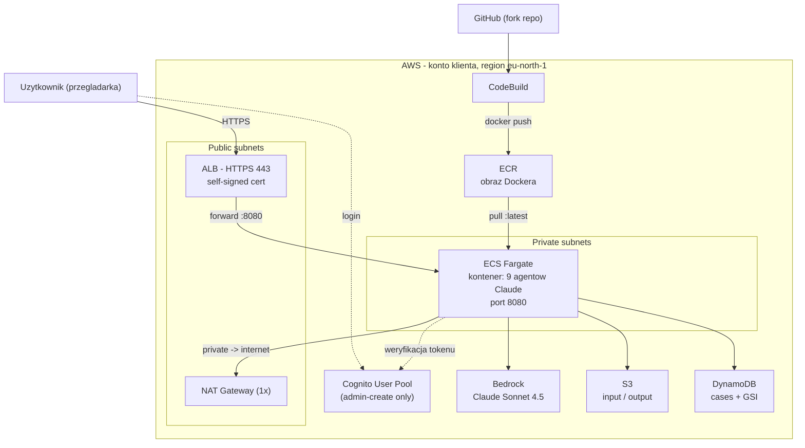

# MAP Agentic Accelerator — materiał na prezentację

> Migracja infrastruktury **AWS Migration Business Case Generator** z monolitycznego
> CloudFormation na modularny **OpenTofu (Terraform)**, jako wielodostępny (multi-tenant)
> blueprint gotowy do wdrożenia dla dowolnego klienta w pełnej izolacji.
>
> Dokument jest zarazem scenariuszem prezentacji i "ściągą" — czytaj od góry do dołu.

---

## 0. TL;DR (30 sekund do powiedzenia na start)

> "Wzięliśmy gotową aplikację AWS z 9 agentami AI (Claude na Bedrock), która generuje
> business case migracji do chmury. Oryginał AWS dostarcza ją jako jeden wielki plik
> CloudFormation. Podjęliśmy decyzję architektoniczną (ADR), żeby przepisać całą
> infrastrukturę na OpenTofu — modularnie, w pełni sparametryzowane jednym `client_name`,
> tak żeby postawić izolowane środowisko dla nowego klienta jedną komendą. Wdrożyliśmy to
> realnie na koncie STX Next DevOps."

Trzy zdania, które warto zapamiętać:
1. **Co**: CloudFormation → OpenTofu, 9 modułów, multi-tenant.
2. **Po co**: powtarzalny, izolowany "SaaS-like" deployment per klient (`${client_name}-...`).
3. **Efekt**: `tofu apply -var-file=clients/<klient>.tfvars` = kompletne środowisko (55 zasobów).

---

## 1. Problem i decyzja (ADR)

**Punkt wyjścia:** repo `aws-samples/sample-genai-in-modernization` dostarcza wdrożenie
przez jeden plik `cloudformation-launch.yaml`. To działa, ale:
- monolit — trudny do ponownego użycia dla wielu klientów,
- używa **4 Lambd jako "custom resources"** do rzeczy, które Terraform robi natywnie,
- brak czystej parametryzacji pod izolację klientów.

**Decyzja (ADR):** przepisujemy infrastrukturę na **OpenTofu** (open-source'owy fork
Terraform), modularnie, z jedną zmienną `client_name` jako prefiksem wszystkich zasobów.

**Dlaczego OpenTofu, a nie Terraform?** Ten sam język (HCL), otwarta licencja (po zmianie
licencji HashiCorp), pełna kompatybilność. Dla nas: brak vendor lock-in, bez ryzyka
licencyjnego.

---

## 2. Architektura



**Przepływ w skrócie:** użytkownik → HTTPS → ALB (w publicznej podsieci) → przekierowanie na
port 8080 kontenera ECS (w prywatnej podsieci, bez publicznego IP) → kontener woła Bedrock
(agenci AI), S3 (pliki), DynamoDB (historia). Ruch wychodzący z prywatnej podsieci idzie
przez jeden NAT Gateway (oszczędność). Obraz Dockera buduje CodeBuild z forka na GitHub i
wypycha do ECR, skąd ECS go pobiera.

### 9 modułów (co robi każdy)

| Moduł | Odpowiada za |
|---|---|
| `vpc` | Sieć: VPC, podsieci public/private, Internet Gateway, **1x NAT Gateway**, route tables, security groups |
| `ecr` | Repozytorium obrazu Dockera (`force_delete`, lifecycle: trzymaj 5 ostatnich obrazów) |
| `s3` | Dwa buckety: input (uploady RVTools) i output (wygenerowane raporty); wersjonowanie + szyfrowanie |
| `dynamodb` | Tabela `cases` (PAY_PER_REQUEST, hash key `id`) + indeks GSI; śledzenie stanu i historii agentów |
| `iam` | Role: ECS Task Execution, ECS Task (uprawnienia agentów), CodeBuild — z granularnymi politykami |
| `alb` | Application Load Balancer + certyfikat self-signed (TLS) + listener 443 i redirect 80→443 |
| `cognito` | User Pool (tylko admin tworzy userów), domena Hosted UI, app client, pierwszy admin |
| `ecs` | Cluster, task definition (2 vCPU / 4 GB), serwis Fargate; zmienne środowiskowe + sekret z SSM |
| `codebuild` | Projekt budujący obraz z GitHub → ECR (buildspec inline) |

Dodatkowo **`bootstrap/`** (uruchamiany jednorazowo): S3 na stan, DynamoDB do lockowania
stanu, rola `terraform-deployer`, GitHub OIDC provider.

---

## 3. Kluczowa wartość: mapowanie CloudFormation → OpenTofu

Oryginał AWS używa 4 Lambd jako "custom resources". My zastąpiliśmy je natywnymi zasobami —
to najmocniejszy punkt prezentacji, bo pokazuje wartość migracji.

| CF Lambda (custom resource) | Zastąpione przez (natywnie) | Dlaczego lepiej |
|---|---|---|
| `ECRCleanupLambda` | `force_delete = true` na `aws_ecr_repository` | Brak kodu Lambdy do utrzymania |
| `SelfSignedCertLambda` | provider `tls_self_signed_cert` + `aws_acm_certificate` | Deklaratywnie, w stanie Terraform |
| `GetClientSecretLambda` | atrybut `.client_secret` na `aws_cognito_user_pool_client` | Terraform czyta to wprost |
| `BuildTriggerLambda` | `aws codebuild start-build` (ręcznie / CI/CD) | Prostsze, bez ukrytej logiki |

> Zdanie do powiedzenia: *"Cztery Lambdy, które w CloudFormation istniały tylko po to, żeby
> obejść jego ograniczenia, u nas znikają — Terraform robi te rzeczy natywnie. Mniej kodu,
> mniej rzeczy, które mogą się zepsuć."*

---

## 4. Jak to się wdraża (cykl życia — to pokazujesz na żywo)

Cały cykl to 4 komendy. Warto je rozumieć, bo o to najczęściej pytają.

```bash
# 0. Logowanie (raz na sesję ~8-12h)
aws sso login --profile stxnext-devops

# 1. Init — pobiera providery i podłącza zdalny stan (S3). Robione raz per klient.
cd agentic-ai-business-case/infra
tofu init -backend-config=backends/acme.hcl

# 2. Apply — tworzy 55 zasobów (~8-10 min, NAT Gateway najdłużej)
tofu apply -var-file=clients/acme.tfvars      # wpisz: yes

# 3. Build — buduje obraz Dockera z GitHub i wypycha do ECR
aws codebuild start-build --project-name acme-business-case-build \
  --source-version main --region eu-north-1 --profile terraform-deployer

# 4. (po demo) Destroy — kasuje wszystko, żeby nie płacić
tofu destroy -var-file=clients/acme.tfvars    # wpisz: yes
```

**Dlaczego stan (state) jest w S3, a nie na dysku?** Stan to "mapa" tego, co Terraform już
utworzył. Trzymamy go w S3 (z blokadą w DynamoDB), żeby: (a) nie zgubić go przy `destroy`
lokalnie, (b) mógł z niego korzystać zespół i CI/CD, (c) dwie osoby nie zepsuły sobie
nawzajem stanu (lock).

**Model "pożądany vs rzeczywisty":** `tofu apply` zawsze porównuje kod (stan pożądany) z tym,
co realnie jest w AWS, i robi tylko różnicę. Dlatego po `destroy` (pusty stan) `apply`
tworzy wszystko od zera.

### Nowy klient = 2 pliki i 1 komenda
```bash
cp backends/acme.hcl  backends/globex.hcl      # zmień key -> clients/globex/...
cp clients/acme.tfvars clients/globex.tfvars   # zmień client_name = "globex"
tofu init -backend-config=backends/globex.hcl -reconfigure
tofu apply -var-file=clients/globex.tfvars
```
> To jest sedno "multi-tenant": ten sam kod, inny `client_name`, pełna izolacja
> (`globex-ecs-cluster`, `globex-alb`, osobny stan w S3).

---

## 5. Demo na żywo — scenariusz przeklikania

Kolejność, którą warto pokazać (od kodu, przez konsolę AWS, po działającą apkę):

1. **Kod (IDE)** — pokaż strukturę `infra/`: `main.tf` woła 9 modułów; jeden `client_name`
   przewija się wszędzie. Otwórz np. `modules/ecs/main.tf`.
2. **Terminal** — `tofu output` → pokaż `alb_url`, `ecr_repository_url`,
   `cognito_domain`, `ecs_cluster_name`.
3. **Konsola AWS → ECS** → klaster `acme-ecs-cluster` → serwis → zakładka Tasks: task w
   stanie **RUNNING**. Pokaż zakładkę "Logs" (logi z kontenera w CloudWatch).
4. **Konsola AWS → EC2 → Target Groups** → `acme-tg` → Targets: status **healthy** (to
   znaczy, że ALB widzi zdrowy kontener na `/api/health`).
5. **Konsola AWS → Cognito** → User Pool `acme-business-case-users` → Users: widoczny admin
   (Twój email).
6. **Konsola AWS → DynamoDB** → tabela `acme-business-case-cases` (tu ląduje historia).
7. **Aplikacja** — otwórz `alb_url` w przeglądarce → zaakceptuj ostrzeżenie o certyfikacie
   (self-signed, tak ma być na PoC) → przekierowanie na **Cognito Hosted UI** → zaloguj się
   → aplikacja generatora.

**Test zdrowia z terminala (efektowny, szybki):**
```bash
curl -k $(tofu output -raw alb_url)/api/health      # oczekiwane: 200 OK
```

> Uwaga o certyfikacie: przeglądarka pokaże ostrzeżenie "niezaufany certyfikat". To
> **zamierzone** — używamy self-signed dla PoC. W produkcji podstawiłoby się prawdziwy
> certyfikat z ACM + domenę.

---

## 6. Temat 1 — Koszty Bedrock (3 sensowne modele)

Aplikacja płaci za AI modelem "pay-per-use" — liczysz **za tokeny** (osobno wejście/wyjście).

### Cennik on-demand (za 1 mln tokenów, ceny 2026)

| Model | Input / 1M | Output / 1M | Kiedy używać |
|---|---|---|---|
| **Claude Haiku 4.5** | **$1** | **$5** | Najtańszy, szybki — proste zadania: klasyfikacja, ekstrakcja, podsumowania |
| **Claude Sonnet 4.5** (OBECNY) | **$3** | **$15** | Najlepszy stosunek jakość/cena — nasz domyślny dla 9 agentów |
| **Claude Opus** (premium) | **~$5** | **~$25** | Najmocniejszy — najtrudniejsze rozumowanie; drogi |
| *Amazon Nova Lite* (alternatywa) | *$0.06* | *$0.24* | *Ultra-tani — można nim obsłużyć część prostszych agentów* |

Uwaga: w regionach `eu-*` używamy **cross-region inference** (prefiks `eu.`), co dokłada
~10% do ceny. Output jest **5× droższy** od inputu — dlatego liczy się długość odpowiedzi.

### Ile kosztuje 1 wygenerowany business case?

Wzór: `koszt = (input_tokens x cena_input + output_tokens x cena_output) / 1_000_000`

Przykładowe założenie (9 agentów, wieloetapowo, `max_tokens=8192`, średni zestaw RVTools):
~**250 000 tokenów wejścia** + ~**60 000 tokenów wyjścia** na cały raport.

| Model | Input (0.25M) | Output (0.06M) | **Koszt / 1 raport** |
|---|---|---|---|
| Haiku 4.5 | $0.25 | $0.30 | **~$0.55** |
| **Sonnet 4.5** | $0.75 | $0.90 | **~$1.65** (+~10% eu ≈ $1.80) |
| Opus | $1.25 | $1.50 | **~$2.75** |

> Zdanie: *"Jeden pełny business case Sonnetem to około 1,5-2 dolara. Haiku zbiłoby to
> poniżej dolara kosztem jakości; Opus podnosi do ~3 dolarów za najwyższą jakość rozumowania."*

### Jak jeszcze obniżyć koszt AI
- **Batch inference: -50%** — jeśli raporty nie muszą być natychmiast (przetwarzanie wsadowe).
- **Prompt caching: do -90%** na powtarzalnym wejściu (np. te same instrukcje systemowe
  dla wszystkich agentów).
- **Model routing** — proste kroki na Haiku/Nova, trudne na Sonnet. Potrafi dać kilkukrotną
  różnicę w rachunku.

---

## 7. Temat 2 — ECS on/off (co to dokładnie znaczy)

**ECS Fargate** rozlicza się **za czas działania kontenera** — płacisz za vCPU-godziny i
GB-godziny **tylko wtedy, gdy zadanie (task) działa**.

Sterujemy tym parametrem `desired_count` (ile kopii kontenera ma działać):
- `desired_count = 1` → kontener **włączony**, aplikacja odpowiada (~$2.40/dzień za 2vCPU/4GB).
- `desired_count = 0` → **zero kontenerów**, koszt compute = **$0**. Aplikacja nie odpowiada.

```bash
# STOP (wyłącz compute, zero kosztu Fargate)
aws ecs update-service --cluster acme-ecs-cluster \
  --service acme-business-case-service --desired-count 0 \
  --region eu-north-1 --profile terraform-deployer

# START (przed demo — kontener wstaje w ~1-2 min)
aws ecs update-service --cluster acme-ecs-cluster \
  --service acme-business-case-service --desired-count 1 \
  --region eu-north-1 --profile terraform-deployer
```

**Ważne:** "ECS off" wyłącza **tylko compute**. Wciąż płacą się rzeczy "zawsze włączone":
- **NAT Gateway** (~$1.20/dzień) i **ALB** (~$0.60/dzień) → razem ~$1.90/dzień przy ECS off.
- Dlatego "off na noc" oszczędza compute, ale nie zeruje rachunku. **Zerowy rachunek = `tofu destroy`.**

> Analogia: `desired_count 0/1` to jak wyłączenie serwera (przestajesz płacić za prąd), ale
> `NAT/ALB` to abonament, który idzie dalej. `tofu destroy` to wypowiedzenie umowy.

---

## 8. Temat 3 — Czy Lambda oszczędzi koszty?

**Krótka odpowiedź: dla tej aplikacji — nie warto przepisywać na Lambdę. Prawdziwe
oszczędności są gdzie indziej.**

**Dlaczego Lambda słabo pasuje tutaj:**
- Aplikacja to **długo działający serwer WWW** (Gunicorn, timeout ustawiony na 900 s) z
  interaktywnym UI i orkiestracją 9 agentów. Generacja raportu trwa minuty.
- **Lambda ma twardy limit 15 minut** na wywołanie — złożony raport może go przekroczyć.
- Model Lambdy to "request → response" i **zimne starty** — słabo do trzymania sesji
  logowania (Cognito) i długiego strumieniowania odpowiedzi.

**Gdzie naprawdę leży koszt:** nie w compute, tylko w **NAT Gateway (~$37/mc)**. To on jest
największą stałą pozycją, gdy aplikacja stoi.

**Lepsze dźwignie oszczędności (rekomendacje):**
1. **Scale-to-zero** (`desired_count=0`) poza godzinami pracy — już to mamy.
2. **Fargate Spot: -70%** na compute dla środowisk nieprodukcyjnych/PoC.
3. **Zamiana NAT Gateway na VPC Endpoints** (Bedrock, S3, DynamoDB, ECR) — jeśli kontener
   nie musi wychodzić do "całego internetu", tylko do usług AWS, można wyciąć NAT. Uwaga:
   interface endpoints też kosztują (~$7/mc każdy), więc liczy się to przy dłuższym działaniu.
4. **`tofu destroy` na weekend** — dla PoC najbardziej radykalne (rachunek → $0).

> Werdykt do powiedzenia: *"Lambda to kuszący pomysł na 'serverless = tanio', ale nasza apka
> jest długobieżna i stanowa — nie zmieści się w modelu Lambdy. Więcej ugramy przez Fargate
> Spot, scale-to-zero i eliminację NAT-a niż przez przepisywanie na Lambdę."*

**Kiedy Lambda MIAŁABY sens:** gdybyśmy rozbili aplikację na krótkie, bezstanowe zdarzenia
(np. osobny endpoint upload → kolejka → worker), a nie jeden długi request. To jednak inna
architektura, nie optymalizacja kosztów obecnej.

---

## 9. Temat 4 — Jak inni mogą się logować (decyzja)

**Stan obecny:** Cognito w trybie "admin-create only" — administrator tworzy użytkownika,
ten dostaje **tymczasowe hasło mailem** i loguje się przez **Cognito Hosted UI** (OAuth2
code flow). Nie ma samodzielnej rejestracji.

**Kontekst decyzji:** użytkownicy to głównie **pracownicy STX Next** (mamy Google Workspace
i AWS IAM Identity Center).

| Opcja | Co to daje | Nakład | Ocena dla STX |
|---|---|---|---|
| **Google Workspace jako IdP w Cognito** (OIDC) | Logowanie kontem `@stxnext.pl`, auto-provisioning | Mały | **REKOMENDACJA** — najprościej dla zespołu wewnętrznego |
| **AWS IAM Identity Center → SAML do Cognito** | Reużycie istniejącego SSO STX (eu-central-1) | Średni | Dobra alternatywa, jeśli chcemy wszystko przez AWS SSO |
| **LDAP / Active Directory** | Integracja z on-prem AD | Duży (SAML/ADFS) | Overkill — sensowne tylko przy on-prem AD |
| **Pritunl** | To **VPN**, nie logowanie | — | **Nieporozumienie** — to warstwa sieci, nie tożsamości |

**Ważne rozróżnienie (o to zapytają):**
- **Uwierzytelnianie do aplikacji** (kto to jest) = Cognito + federacja (Google/AWS SSO).
- **Pritunl / VPN** = warstwa **sieciowa** (kto w ogóle dosięgnie ALB). Można to dołożyć
  jako dodatkową ochronę (np. ALB tylko w sieci firmowej), ale **nie zastępuje logowania**.
  To dwie różne rzeczy, które mogą działać razem (defense-in-depth).

**Rekomendacja:** federacja **Cognito ↔ Google Workspace**. Zmiany byłyby w
`modules/cognito/main.tf`:
- dodać zasób IdP (`aws_cognito_identity_provider`, typ Google/OIDC),
- dopisać go do `supported_identity_providers` w app clencie (obok/zamiast `COGNITO`).

> To jest świadoma decyzja "na później" — nie wdrażamy dziś, ale mamy jasną ścieżkę.

---

## 10. Napotkane problemy i jak je rozwiązaliśmy (pokazuje dojrzałość)

| Problem | Przyczyna | Rozwiązanie |
|---|---|---|
| `InvalidRequestException` przy `aws sso login` | zły `sso_region` | Identity Center STX jest w `eu-central-1` |
| `AccessDenied` na `sts:AssumeRole` | za restrykcyjny warunek w trust policy (ARN SSO) | trust policy na `:root`, kontrola po stronie SSO |
| `VpcLimitExceeded` w eu-west-1 | 5/5 VPC zajęte na koncie współdzielonym | zmiana regionu na `eu-north-1` |
| `PermanentRedirect` / zły region w ARN po zmianie regionu | stan trzymał ARN-y ze starego regionu | `destroy` w starym regionie, potem `apply` w nowym |
| `Character sets beyond ASCII` na Security Group | em-dash (—) w polu `description` | tylko ASCII w opisach SG |
| CodeBuild `reference not found feature/terraform-migration` | branch tylko lokalnie, nie w forku | build z brancha `main` |
| Brak Claude 3 Sonnet w eu-north-1 | region ma tylko nowsze modele | kod używa `eu.anthropic.claude-sonnet-4-5` (cross-region) |

---

## 11. Koszty infrastruktury (eu-north-1, orientacyjnie)

| Zasób | Koszt/dzień | Uwaga |
|---|---|---|
| NAT Gateway | ~$1.20 | zawsze działa |
| ALB | ~$0.60 | zawsze działa |
| ECS Fargate (2vCPU/4GB) | ~$2.40 | tylko gdy `desired_count=1` |
| S3/DynamoDB/ECR/Cognito/Logs | ~$0.10 | grosze |
| **Razem (ECS on)** | **~$4.30/dzień** | |
| **Razem (ECS off)** | **~$1.90/dzień** | tylko NAT + ALB |
| **Po `tofu destroy`** | **~$0** | bootstrap kosztuje grosze |

Bedrock = osobno, pay-per-use (patrz sekcja 6).

---

## 12. Roadmap / next steps (czego jeszcze nie ma)

- [ ] Commit `infra/` do forka na branch roboczy.
- [ ] **GitHub Actions**: `tofu plan` na PR, `tofu apply` na merge do `main` (przez rolę
      `terraform-deployer` i GitHub OIDC — provider już postawiony w bootstrapie).
- [ ] Federacja logowania **Cognito ↔ Google Workspace** (sekcja 9).
- [ ] Drobna niespójność do wyrównania: w Cognito `logout_urls` wskazuje na `/logout`, a kod
      aplikacji przekierowuje wylogowanie na `APP_URL` (root) — do ujednolicenia.
- [ ] Produkcja: prawdziwy certyfikat z ACM + własna domena (zamiast self-signed).
- [ ] Docelowo: zacieśnić uprawnienia roli deployera (teraz szerokie na etapie PoC).

---

## 13. Najczęstsze pytania (przygotuj odpowiedzi)

**Q: Dlaczego OpenTofu, a nie Terraform / CDK?**
A: Ten sam HCL co Terraform, otwarta licencja (brak ryzyka po zmianie licencji HashiCorp),
zero vendor lock-in. CDK odrzucamy, bo chcieliśmy deklaratywny, czytelny opis infry bez
warstwy programistycznej.

**Q: Jak zapewniacie izolację między klientami?**
A: Każdy zasób ma prefiks `${client_name}-`, osobny plik stanu w S3 (`clients/<klient>/...`),
osobne buckety, tabela, VPC. Zero współdzielenia.

**Q: Co z bezpieczeństwem?**
A: Kontener w prywatnej podsieci (bez publicznego IP), ruch tylko przez ALB. Sekret Cognito
trzymany w SSM SecureString (nie w plain-text). Granularne role IAM: osobno rola do pobrania
obrazu i logów (execution), osobno uprawnienia kodu agentów (task): `bedrock:InvokeModel`,
dostęp tylko do własnych S3/DynamoDB.

**Q: Ile to kosztuje?**
A: Sekcja 11 (infra ~$1.90-4.30/dzień) + Bedrock ~$1.5-2 za raport (sekcja 6). Na PoC
kasujemy `destroy` i schodzimy do ~$0.

**Q: Ile trwa postawienie środowiska dla nowego klienta?**
A: 2 pliki konfiguracyjne + `tofu apply` = ~10 min do gotowej infry, ~5 min build obrazu.

---

*Dokument roboczy do prezentacji. Szczegóły techniczne i komendy operacyjne: patrz*
*`DEPLOYMENT.md` w tym samym katalogu.*
